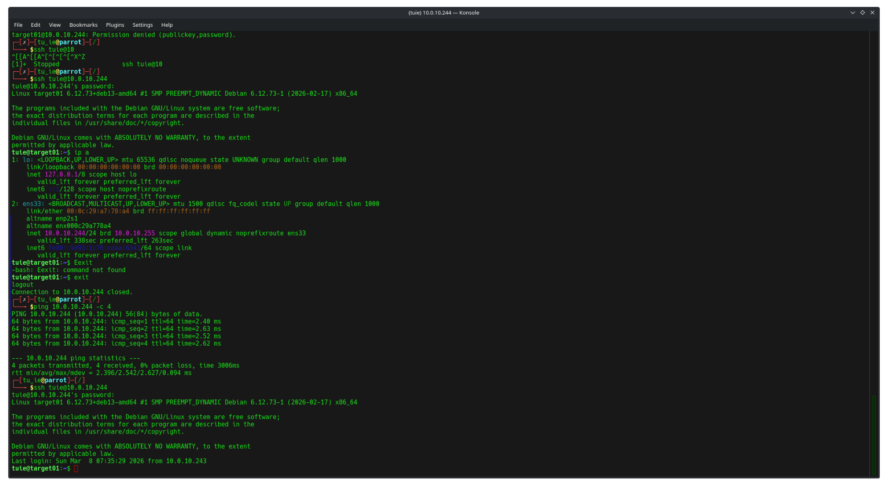
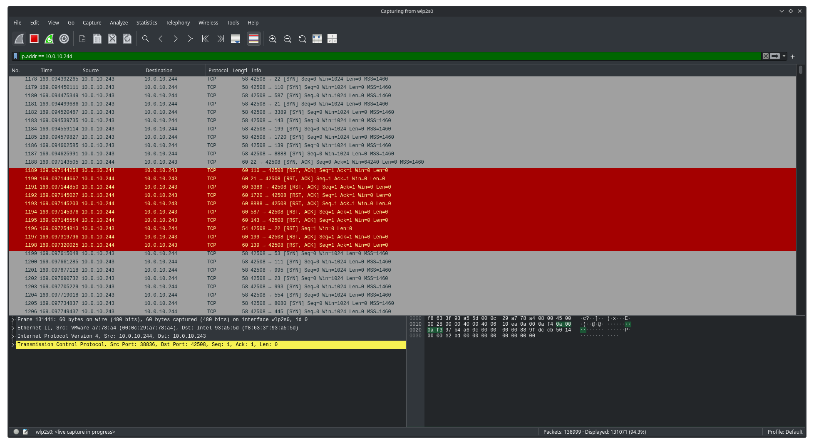

<BS># Enterprise Security Monitoring Lab

## 📌 Project Overview
The objective of this ongoing project is to architect and deploy a locally hosted security lab simulating an enterprise environment. The final architecture will integrate a bare-metal Red Team attacker machine with a virtualized Blue Team infrastructure, featuring Wazuh (SIEM) and OpenVAS for vulnerability scanning and remediation.

## 🏗️ Network Architecture & Technologies
This lab bridges physical and virtualized infrastructure to test real-world TCP/IP routing, VLAN segmentation, and remote access across segmented networks.

### The Physical Layer (Network Infrastructure)
* **Core Routing & Gateway:** MikroTik RB941 (Handling DHCP, VLAN routing, and firewall rules).
* **Switching:** Huawei S2700 Enterprise Switch (Managing physical port allocations and VLAN tagging).
* **Wireless Access:** UniFi Access Point (Providing segmented wireless access for the Red Team laptop).

### The Virtual Layer (Compute & Hypervisor)
* **Hypervisor Host:** Windows desktop running VMware Workstation Pro.
* **Blue Team (Target):** Headless Debian 13 Server (CLI-only to reduce attack surface and minimize resource overhead).
* **Red Team (Attacker):** Bare-metal laptop running Parrot Security OS (Connected via UniFi AP).
* **Bridged Networking:** The VMware virtual network adapter is bridged directly to the physical NIC, allowing the Debian VM to pull a `10.0.10.x` IP address directly from the MikroTik DHCP server rather than relying on host NAT.

---

## 🚀 Phase 1: Infrastructure Provisioning & Bridged Networking

### 1. Headless Server Deployment
To align with enterprise data center standards, the target machine (`target01`) was provisioned as a purely headless Debian server. All graphical user interfaces (GUI/Desktop Environments) were stripped during installation to enforce strict Linux CLI administration and reduce unnecessary software vulnerabilities. 

### 2. Physical-to-Virtual Network Bridging
The Debian VM's network adapter was configured in **Bridged Mode** rather than the default NAT. This allowed the virtual machine to bypass the Windows host's internal routing, interface directly with the physical MikroTik router, and pull a dedicated IP address (`10.0.10.244`) from the DHCP pool. 

### 3. Verification & Remote Administration
To verify TCP/IP routing across the physical and virtual layers, successful ICMP requests were sent from the bare-metal Parrot OS machine to the virtualized Debian server. 

Following the successful ping test, a secure remote administration session was established using SSH from the attacker machine to the target, proving the headless server can be securely managed over the network.

### 📸 Proof of Execution

## 🔍 Phase 2: Active Reconnaissance & Network Traffic Analysis (NTA)

### 1. The Attack Vector (Nmap)
To map the target's attack surface, an active reconnaissance scan was launched from the bare-metal Red Team machine against the virtualized Blue Team target. A **TCP SYN Stealth Scan (`nmap -sS -p-`)** was executed across all 65,535 ports. This specific scan technique was utilized to identify listening services while actively tearing down the connection (`RST`) before the application layer could log a completed 3-way handshake.

### 2. Packet Capture & Analysis (Wireshark)
Simultaneous to the Nmap scan, Wireshark was deployed to monitor the physical-to-virtual network interface. Traffic was filtered strictly to the target IP (`ip.addr == 10.0.10.244`) to capture the raw packet flow of the attack.

### 3. Execution Results
The Network Traffic Analysis (NTA) mathematically validated the Attack Surface Reduction implemented in Phase 1:
* **Closed Ports:** Wireshark captured the Debian server explicitly rejecting unauthorized port knocks with `[RST, ACK]` (Reset, Acknowledge) packets, proving unnecessary services were successfully stripped.
* **Open Ports:** The packet capture isolated the exact microsecond the target's SSH daemon responded to the Nmap scan with a `[SYN, ACK]` packet on Port 22, accurately reflecting the controlled remote-administration entry point.

### 📸 Proof of Execution

